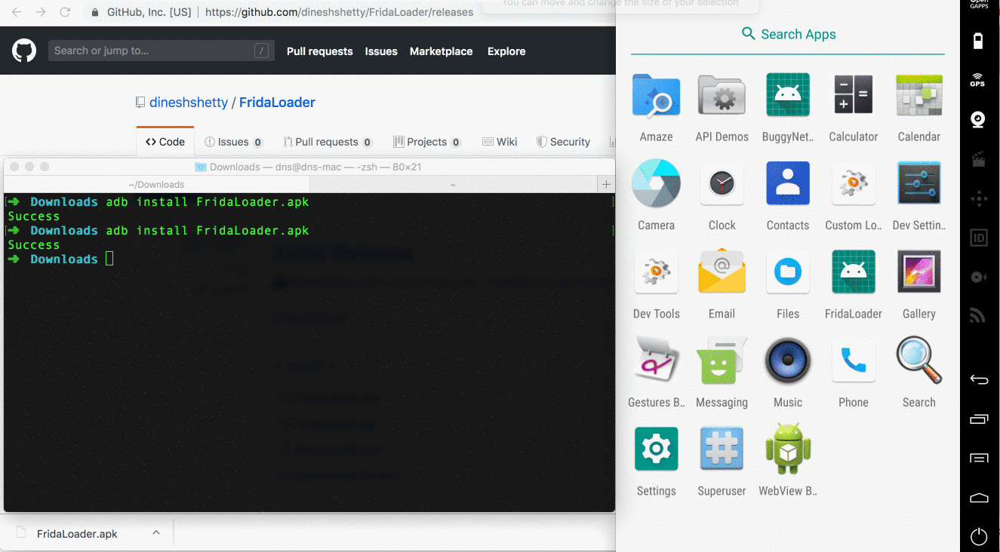

# FridaLoader
A quick and dirty app to download and launch Frida x86 server on Genymotion. 

One click tool to download and launch the latest version of the Frida x86 Server on a Genymotion emulator.

Make sure your AVD is connected to the internet when using FridaLoader.

# Demo

# To Do
* Add support for arm and x86-64 based Frida servers
